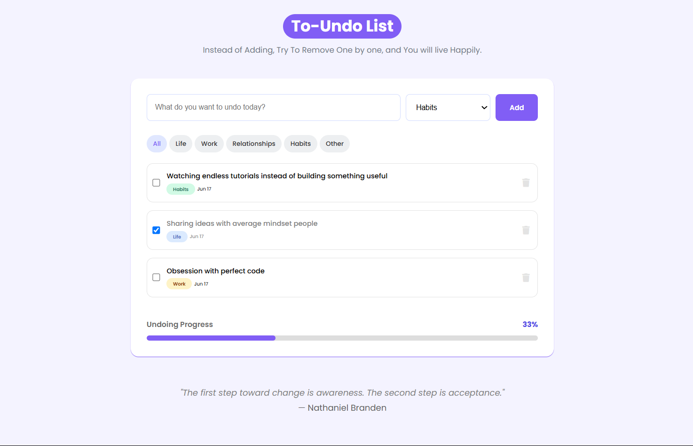

## To Undo List - Happy way of accomplishing.

**A beautifully crafted undo list for tracking life’s regrets, missteps, and decisions worth reconsidering.** 🚀  

***Website inspired by the quote -***

> Rather than adding and getting frustrated, try to remove one by one, you will feel lighter and move fast.

&nbsp;

### 📌 About This Project  
- **pure CSS and vanilla JavaScript**
- Inspiration from a **Canva AI-generated design**
- To understand modern design aesthetics
- **Entire code** from styles to functionality is written **from scratch** using traditional web technologies.

&nbsp;

The **concept** of the To-Undo List is what i just thought randomly and not found any website designed to create a space where users can reflect on what they wish to "undo" in their work, relationships, or personal life, so I built this.  

### ✨ Features  
✅ Fully responsive design using **handwritten CSS**  
✅ No frameworks—just **pure JavaScript**  
✅ Meaningful way to track things that deserve **a second thought**  

### 🌍 Live URL
[Try To-undo-list](https://to-undo-list.netlify.app) 

### 🖼️ Screenshot  
  

### 😁 Thank you
